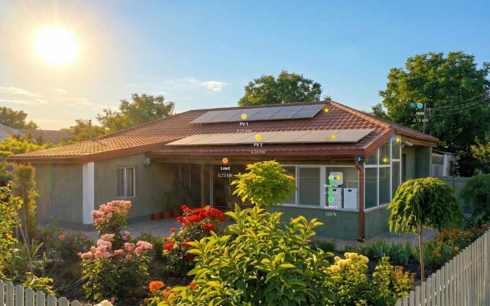

# FlowMe

> Animated flow visualisation with freely positioned nodes for Home Assistant



A custom Lovelace card that renders animated flow visualisations between freely positioned nodes over a configurable background. Supports multiple flow domains, rich animation styles, weather-reactive backgrounds, and a fully visual drag-and-drop editor.

---

## How FlowMe was built

FlowMe is the result of a three-way collaboration:

- **Human** — product vision, design decisions, feature priorities, testing and direction
- **Claude (Anthropic)** — research, architecture, specifications and prompt engineering
- **Cursor** — code implementation, auditing and building

Every feature was human-directed, AI-researched, and AI-coded. No line of production code was written by hand.

---

## Features

### Animation styles

`dots` · `dash` · `arrow` · `trail` · `fluid` · `none`

### Particle shapes

`circle` · `square` · `arrow` · `teardrop` · `diamond` · `custom_svg`

### Domains

Energy · Water · Network · HVAC · Gas · Generic — each with calibrated peak values and colour profiles. Domain controls flow colour and animation speed calibration.

### Direction

`auto` (follows sensor sign) · `forward` · `reverse` · `both` (dual simultaneous streams)

### Editor

Drag-and-drop visual editor with five tabs (Card / Nodes / Flows / Overlays / Settings), collapsible canvas, chip pickers, zoom/pan, waypoint editing, A\* + Sobel suggest path, undo/redo, background image browser.

### Other features

- Weather-reactive background switching
- Animated backgrounds (GIF, WebP, APNG)
- Transparent mode (HA theme shows through)
- Custom overlays (embed any HA card)
- Value gradient (colour by secondary sensor)
- Node effects (glow, badge, ripple, alert)
- `flow.label` and `node.label` for display names
- Smooth speed interpolation (animation ramps to new speed, no jarring restarts)
- Selective flow updates (stable flows never restart when unrelated sensors update)
- Per-flow and per-node visibility toggles
- Custom SVG particles
- Particle spacing modes (even, random, clustered, wave)
- i18n (drop a JSON translation file)
- Accessibility (ARIA, focus outlines, reduced-motion)
- Single file distribution (`flowme-card.js`, worker inlined)
- Material You / HA theme compatible

---

## Compatibility & testing notes

FlowMe was developed and tested primarily on a residential solar / battery / grid energy setup.

### Well tested ✅

- Energy domain — solar, grid, battery and load flows
- All animation styles and direction modes
- Background image switching with weather states
- Transparent mode
- Custom overlays with standard HA card types (picture-entity, tile, button, mini-graph-card etc.)
- Visual editor — drag, suggest path, undo/redo
- Chrome and Firefox on desktop

### Implemented, limited real-world testing ⚠️

- Water, gas, network, HVAC and generic domains — animation works correctly but sensor unit coverage may have gaps for less common units (e.g. gal/min, ft³/h, CFH)
- Node effects (glow, badge, ripple, alert)
- Value gradient
- Suggest Path on complex or low-contrast background images

### Sensor units

FlowMe reads `unit_of_measurement` from your sensor and converts to the domain base unit automatically. Common units are covered. If your sensor uses an uncommon unit and animation speed seems off, set `peak_value` on the flow to match your sensor's actual scale.

### Reporting issues

FlowMe is sensibly maintained in my spare time. If you encounter issues with a specific sensor type, domain or unit, please open a GitHub issue including your sensor's `unit_of_measurement` and the domain you are using.

---

## Recommended companion

FlowMe adapts to your Home Assistant theme automatically. For the strongest dynamic colours, install [Material You Utilities](https://github.com/addoyle/material-you-utilities), which enables colour extraction from your wallpaper.

---

## Installation

### HACS (recommended)

FlowMe is submitted to the HACS default store. While awaiting approval, add it as a custom repository:

1. In HACS → Custom repositories, add: `https://github.com/fxgamer-debug/flowme`  
   Category: **Dashboard**

2. Search for FlowMe and install the latest version (or download the latest release asset)

3. Restart Home Assistant

4. Add via the Lovelace card picker or YAML

### Manual

1. Download `flowme-card.js` from the latest release on GitHub

2. Place it in `/config/www/` (or another path you expose under `/local/`)

3. Add to Lovelace resources:

   ```yaml
   url: /local/flowme-card.js
   type: module
   ```

4. Restart Home Assistant

---

## Quick start

Minimal configuration to get started:

```yaml
type: custom:flowme-card
domain: energy
background:
  default: /local/my-background.jpg
nodes:
  - id: solar
    position: { x: 30, y: 20 }
    entity: sensor.solar_power
    label: Solar
  - id: home
    position: { x: 60, y: 50 }
    entity: sensor.load_power
    label: Home
flows:
  - id: solar_to_home
    from_node: solar
    to_node: home
    entity: sensor.solar_power
```

---

## Background images

⚠️ **Do not store background images inside `/config/www/community/flowme/`.** That directory is managed by HACS and can be deleted or replaced when the card updates. Use a folder you own instead, for example **`/config/www/flowme-backgrounds/`**, which Home Assistant serves at **`/local/flowme-backgrounds/`**.

Place your background images in `/config/www/flowme-backgrounds/`. They are served at URLs such as `/local/flowme-backgrounds/filename.jpg`.

To enable the visual image browser in the FlowMe editor, add this to your `configuration.yaml`:

```yaml
homeassistant:
  media_dirs:
    flowme: /config/www/flowme-backgrounds
```

Then restart Home Assistant. The **Browse** button in the editor will show thumbnails of all images in that folder.

Without this setup, you can still enter background image URLs manually.

### Animated backgrounds

FlowMe supports animated background images (GIF, animated WebP, APNG). Place the file in `/config/www/flowme-backgrounds/`, then set the URL as usual, for example:

```yaml
background:
  default: /local/flowme-backgrounds/rain.gif
```

Suggested upper bounds for smooth performance: GIF under 2MB; animated WebP under 1MB; APNG under 1MB (WebP often looks better than GIF at a smaller size).

---

## Configuration

### Top-level options

| Option        | Type    | Default        | Description                                      |
| ------------- | ------- | -------------- | ------------------------------------------------ |
| `domain`      | string  | `energy`       | Flow domain: `energy`, `water`, `network`, `hvac`, `gas`, `generic` |
| `debug`       | boolean | `false`        | Enable console logging                          |
| `aspect_ratio`| string  | (image native) | Canvas aspect ratio, e.g. `16:10`               |
| `pause_when_hidden` | boolean | `true` | Pause animations when the browser tab is hidden |

### Background

| Option                        | Type   | Description |
| ----------------------------- | ------ | ----------- |
| `background.default`          | string | Default background image URL |
| `background.weather_entity`   | string | Weather entity ID for state-based images |
| `background.sun_entity`       | string | Sun entity (e.g. `sun.sun`) for night variant keys |
| `background.transition_duration` | number | Crossfade duration in **milliseconds** (default 5000 if omitted) |
| `background.weather_states`   | object | Map of weather state → image URL |
| `background.transparent`      | bool   | When `true`, transparent card chrome and hide background imagery; URLs stay in config (default `false`) |

### Transparent background

Use **`background.transparent: true`** when you want the Lovelace theme to show through: the card uses a transparent host and does not paint the default or weather-driven background layers, while your URLs remain in YAML for when you set the flag back to `false`. You can also omit or leave **`background.default`** empty for a transparent card without setting the flag.

### Nodes

| Option        | Type    | Description |
| ------------- | ------- | ----------- |
| `id`          | string  | Unique node identifier |
| `position.x`  | number  | Horizontal position 0–100% |
| `position.y`  | number  | Vertical position 0–100% |
| `entity`      | string  | HA entity for value display |
| `label`       | string  | Display label |
| `show_label`  | boolean | Show node label (default `true`) |
| `show_value`  | boolean | Show sensor value (default `true`) |
| `visible`     | boolean | Show/hide the node (default `true`) |
| `opacity`     | number  | Node opacity 0–1 (default `1`) |
| `color`       | string  | Override node colour |
| `node_effect` | object  | Node effect configuration (`glow`, `badge`, `ripple`, `alert`) |

### Flows

| Option            | Type   | Description |
| ----------------- | ------ | ----------- |
| `id`              | string | Unique flow identifier |
| `from_node`       | string | Source node ID |
| `to_node`         | string | Destination node ID |
| `entity`          | string | Sensor entity driving the flow |
| `animation_style` | string | `dots` \| `dash` \| `arrow` \| `trail` \| `fluid` \| `none` |
| `particle_shape`  | string | `circle` \| `square` \| `arrow` \| `teardrop` \| `diamond` \| `custom_svg` |
| `direction`       | string | `auto` \| `forward` \| `reverse` \| `both` |
| `line_style`      | string | `corner` \| `diagonal` \| `curve` \| `smooth` |
| `color`           | string | Override flow colour |
| `value_gradient`  | object | Gradient colour config |
| `label`           | string | Optional display label for the flow (inspector and ARIA); omit or match `id` to hide |
| `visible`         | boolean | When `false`, hides the flow line and particles on the dashboard card (default `true`) |

Per-flow animation options — including style, direction, spacing, and timing fields such as `min_duration`, `max_duration`, and `zero_threshold` — belong under an **`animation:`** object. Set **`peak_value`** on the flow itself (sibling to `animation:`) to override the domain default peak for speed calibration. Example:

```yaml
flows:
  - id: solar_to_home
    from_node: solar
    to_node: home
    entity: sensor.solar_power
    peak_value: 5000
    animation:
      animation_style: dots
      direction: auto
      min_duration: 100
      max_duration: 10000
      zero_threshold: 0.002
```

### Overlays

```yaml
overlays:
  - type: custom
    position: { x: 10, y: 10 }
    size: { width: 20, height: 15 }
    card:
      type: picture-entity
      entity: camera.front_door
      show_name: false
```

---

## Domains

FlowMe includes built-in profiles for six domains. Default **peak** values used for speed-curve calibration:

| Domain  | Roles | Default peak |
| ------- | ----- | ------------- |
| `energy` | Solar, Grid, Battery, Load | **5000** W |
| `water` | Supply, Drain, Storage, Transfer | **25** L/min |
| `network` | Upload, Download, Local, External | **100** Mbps |
| `hvac` | Supply air, Return air, Fresh, Exhaust | **600** m³/h |
| `gas` | Inlet, Outlet, Bypass, Vent | **5** m³/h |
| `generic` | Flow 1–4 | **100** (dimensionless) |

FlowMe reads `unit_of_measurement` from the HA sensor and displays it as-is. Adjust **`defaults.peak_value`** (or per-flow overrides) if your sensors use a different scale than these defaults.

---

## Translations

FlowMe ships with English as the default. To add a translation:

1. Copy `translations/en.json` from this repository
2. Translate all values (keep keys unchanged)
3. Save as your language code, e.g. `fr.json`
4. Place at `/config/www/flowme/translations/fr.json`

FlowMe loads it automatically when HA is set to that language. Partial translations are supported — missing keys fall back to English.

To contribute, open a pull request adding your file to the `translations/` folder.

---

## Development

### Prerequisites

Node.js 20+, npm

### Setup

```bash
git clone https://github.com/fxgamer-debug/flowme
cd flowme
npm install
```

### Dev server (no HA required)

```bash
npm run dev
```

Opens `http://localhost:5173` with a mock Home Assistant environment and live reload.

### Build

```bash
npm run build
```

### Test

```bash
npm run test
```

---

## Licence

MIT
